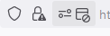
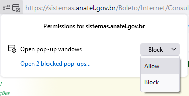

# Como emitir boleto para quitação do FISTEL

Nota: antes de começar, tenha em mãos o CPF ou CNPJ do titular da estação e  Número Fistel.

Informação: Para confirmar o número FISTEL, [consulte este link](Como_confirmar_FISTEL).

* Abra [www.anatel.gov.br](https://www.anatel.gov.br)
* Role toda página para baixo até 'Canais de Atendimento'. Clique em ['Sistemas'](https://www.gov.br/anatel/pt-br/canais_atendimento/sistemas)
* Role para baixo e clique em ['Sistema de Consulta Débitos de FISTEL'](https://sistemas.anatel.gov.br/Boleto/Internet/Index_Boleto.asp)
* Clique em '[Impressão de Boletos'](https://sistemas.anatel.gov.br/Boleto/Internet/Tela.asp)
* Informe CPF ou CNPJ do titular da estação e Número Fistel
* Selecione 'Devedores'. Em 'Data Pagamento', escolha a data de vencimento do boleto. Clique 'Confirmar'.
* Marque caixas dos boletos para imprimir. Clique 'Imprimir Selecionados'. O browser mostra uma nova janela com os boletos previamente marcados.

Nota: se nenhuma janela surgir ao clicar 'Imprimir Selecionadors', o browser está surprimindo janelas pop-up para o site da Anatel. Você deve clicar no ícone da barra de endereço e permitir os pop-ups, veja exemplo abaixo.

| Browser  | Notificação de pop-up bloqueado                                       | Opções para permitir pop-ups                                     |
|----------|-----------------------------------------------------------------------|------------------------------------------------------------------|
| Firefox  |  |  |
| Chrome   |                                                                       |                                                                  |
| Edge     |                                                                       |                                                                  |
| Explorer |                                                                       |                                                                  |

* A janela pop-up apresenta o menu de impressão. Ajuste conforme necessário, por exemplo, gerar um arquivo PDF. Proceda com a impressão.
