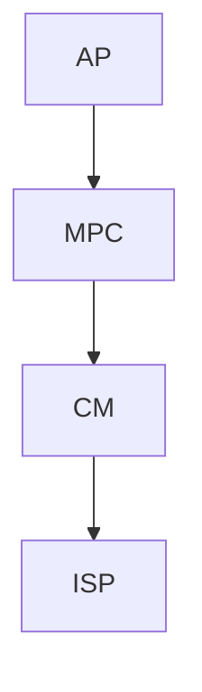

## MS Dev VM into Proxmox

Steps provided by [Jason Murray's Install Win11 Dev VMware Image on the Proxmox Hypervisor](https://jasonmurray.org/posts/2022/install-win11-dev-proxmox/)

### Download and conversion

* cd /tmp/win11dev (or other dir with room for 100GB+)
* wget https://aka.ms/windev_VM_vmware
* unzip (will create .vmdk, .mf and .odf files)
* create VM on GUI and/or use command bellow as guideline

    qm create 666 --bios ovmf --efidisk0 storage-pool-1-dir:1 --cores 4 --cpu host --machine pc-q35-7.0 --memory 32000 --name 1229-win11-2 --net0 e1000,bridge=vmbr0,firewall=1 --onboot yes --ostype win11 --ide0 storage-pool-1-dir:16 --scsihw virtio-scsi-pci --sockets 4 --memory 32000 --tpmstate0 storage-pool-1-dir:1
    
* conver vmdk file to qcow, with command template below:

Original
    qemu-img convert -f vmdk /storage-pool-1/OS-images/win11-dev/WinDev2210Eval-disk1.vmdk -O qcow2 /storage-pool-1/vz/images/666/vm-666-disk-1.qcow2
    
After adapting
    qemu-img convert -f vmdk /tmp/win11dev/WinDev2305Eval-disk1.vmdk -O qcow2 /var/lib/vz/images/501/vm-501-disk-1.qcow2

* edit line changing type and size

nano /etc/pve/local/qemu-server/501.conf
  
from:
ide0: storage-pool-1-dir:666/vm-666-disk-1.raw,size=16G

to:
ide0: storage-pool-1-dir:666/vm-666-disk-1.qcow2,size=43G

### System Information and Post Configuration
* Default Username: user
* Default Password: <unset>
* Set password: Settings -> Accounts -> Sign-In Options -> Password -> Add
* Enable remote desktop: Settings -> System -> Remote Desktop -> On -> Confirm

