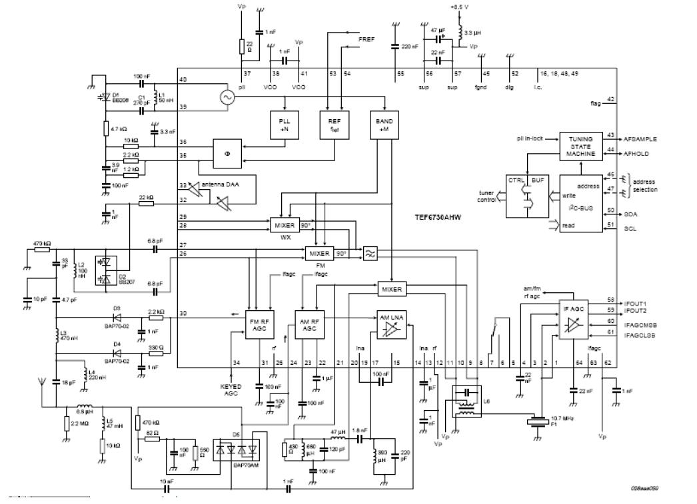
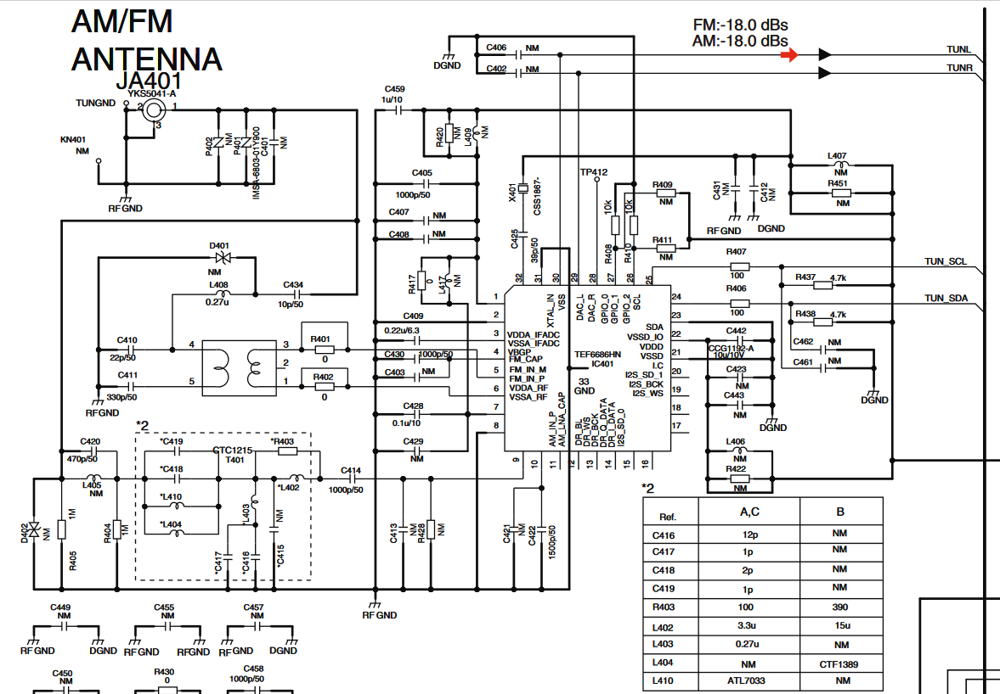

# Anotações aleatórias sobre o CI NXP TEF6686 para aplicação de DX em VHF FM broadcast (88-108MHz)
{: .no_toc}

## Índice
{: .no_toc}

1. Índice
{:toc}

## NXP SAF7751 and TEF6686: CIs usados em auto-rádios modernos com ótimo desempenho em FM

Neste fio, um colega da China 'eggplant886' explica sua preferência pelos CIs da NXP (Philips) 

> For sensitivity and selectivity,I prefer SAF7751 and TEF6686. The former one is a single tuner, offers a high end feature set such as Channel Equalizer and Multipath improvement. SAF7751 is the most advanced receiver ever used in car tuners, this one supports more features such as FM phase diversity which utilizes two antennas at the same time.Further more,the advanced Improved phase diversity algorithm could be used for better performance which requires firmware update.
>
> https://www.diyaudio.com/forums/analogue-source/334234-am-fm-tuner-2.html

## Sony XDR-F1HD and XDR-S3HD: receptores para DX em FM sem necessidade de modificações

Todd Emslie publicou uma análise e concluiu assim sua avaliação da linha XDR da Sony:

> With the introduction of the new Sony XDR-F1HD and XDR-S3HD DSP FM tuners, IF selectivity / audio fidelity performance has reached a pinnacle. For many DXers, portable radios, ceramic filter tuner modifications and most other available tuners will be largely uneccesary. However, ceramic IF filter modifications are still useful with high performance tuners such as the Onkyo T-9090 II and Kenwood KT-6040. Serious DX installations usually incorporate a range of receivers and tuners for specific requirements. The Sony XDR FM tuner series will be an important component of any serious DX installation.
> 
> The XDR-S3HD is likely the best tuner available anywhere for serious DX work, while the XDR-F1HD comes second. With the XDR-S3HD, Sony have incorporated the world's best tuner with a rotary tuning dial, volume control, internal speaker, and external power transformer. 
>
> http://home.iprimus.com.au/toddemslie/sony_xdr-F1HD_tuner.html

## NXP TEF6730: CI para FM do Sony XDR

Em artigo 'Tuner Sony XDR-F1HD a 12 v per uso mobile' publicado no blog 'Radio & Communication Info' de Giampiero Bernardini, 
seu colega I1RFQ Claudio Re descreve como modificar um Sony XDR para operar em 12v. No texto, Claudio explica brevemente o circuito:

> I received from Giampiero Bernardini a Sony XDR F1HD to modify at 220 V AC and 12 Vcc for portable use.
> 
> This receiver is based on the NXP chipset technology .
> 1) TEF6730 as AM-FM ( MW and Band II ) Tuner (see fig. 1)
> 2) SAF7730 as DSP IF demodulator
> 3) SAF3550 as HD (IBOC) Decoder
>
> http://radiodxinfo.blogspot.com/2009/08/tuner-sony-xdr-f1hd-12-v-per-uso-mobile.html

 
Destaque do circuito do Sony XDR-F1HD com o CI TEF6730. Créditos: I1RFQ

## TEF6686 em circuitos caseiros de receptores FM DX

Alguns DXistas de FM mantém canais no Youtube compartilhando suas experiências em uma montagem caseira com o TEF6686 na parte de RF e o Arduino para interface com o usuário:

* [RTVDXRO](https://www.youtube.com/c/RTVDXRO/videos)
* [Nicu Florica](https://www.youtube.com/user/dj06ntm/videos)
* [fmdxbp](https://www.youtube.com/user/fmdxbp/videos)
* [Eustake](https://www.youtube.com/user/dxfmtv/videos)
* [MCSFMDX](https://www.youtube.com/c/MCSFMDX/videos)
* [pg103 Flo](https://www.youtube.com/channel/UCQeqf_qjojF8TeumUVy7puA/videos)

RTVDXRO é o canal com maior atividade recente. Vários vídeos de RTVDXRO comparam o desempenho do TEF6686 com o Onkyo T4670 (com modificações) e ambos parecem ter comportamento muito próximo.  

## Receptores comerciais baseados o TEF6686

Em Nov/2020, o canal RTVDXRO publicou dois vídeos sobre o auto-rádio Pioneer MVH-289BT indicando que o mesmo usa um CI TEF668x.

* [TEF668x Pioneer MVH-289BT Test on Arduino](https://www.youtube.com/watch?v=p-dzyDmCqho&t=4s)
* [FM DX Test Radio Hristo Botev Kodžakuz on Pioneer MVH 289BT (TEF6686) vs Onkyo T 4670 (mod)](https://www.youtube.com/watch?v=8z5UIzBMrCU)

Verificando o manual de serviço  [link](img/pioneer_mvh-285bt_mvh-289bt_crt5745.pdf), pode-se confirmar a presença do TEF6686 no Pioneer MVH-289BT.

Destaque do circuito do Pioneer MVH-289BT, CI de RF TEF6686.

## TEF6686 em Pioneer

### Prefixos Pioneer

* DEH: CD Player
* MVH: Media Receiver
* AVH: Multimedia Receiver
* Modelos BR sempre incluem dígito 8

### Pesquisando por "Pioneer TEF6686HN"

| Modelo | TEF6686? |
|---|---|
|AVH-X7700BT|
|AVH-X7750BT|
|DEH-1700UB|
|DEH-X1710UB| Confirmado no Service Manual |
|DEH-X1750UB| Confirmado no Service Manual |
|DEH-X1790UB| Confirmado no Service Manual |
|DEH-X3750UI|
|DEH-X3790UI|
|DEH-X6700BS|
|MVH-07UB|
|MVH-075UB|
|MVH-170U|
|MVH-285UB| Confirmado no Service Manual |
|MVH-289UB| Confirmado no Service Manual |
|MVH-X175U|
|MVH-X179U|
|MVH-170UB| Confirmado no Service Manual |
|MVH-170UBG| Confirmado no Service Manual |
|MVH-170UI| Confirmado no Service Manual |
|MVH-X175UI| Confirmado no Service Manual |
|MVH-X179UI| Confirmado no Service Manual |

### Possíveis modelos tropicalizados
* https://pioneer.com.br/produto/mvh-x178ui/

